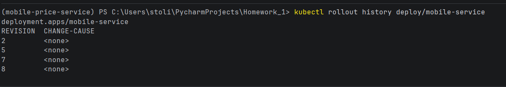
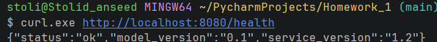
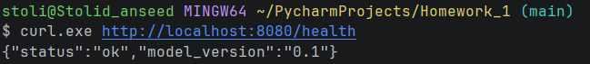

## Ключевые команды:

1. Pytest - запускает проверку 8 тестов
``` Bash
uv run pytest
```


2. Docker compose 
``` PowerShell
docker compose up -d --build
```


3. Kind - создаёт кластер "hw"
``` Bash
kind create cluster --name hw
```


## Скриншоты для проверки:
### SELECT из таблицы логов
```
docker compose exec db psql -U postgres -d mobile_price -c "SELECT request_id, mobile_price, latency_ms FROM predictions;"
```

### port-forward:
1. Kubectl - показывает кластеры для работы и немного их характеристик(Ready 0/1, status, age)
```
kubectl get pods
```


2. Обычный интерфейс k9s


3. подключенный port 

4. Команда для проверки работы kubernets
``` bash
curl ‐X POST localhost:8080/v1/predict ‐H "Content‐Type: application/json" ‐d @test.json
```


5. Показываю, что кластеры работают с командой выше


## Дополнительная часть:
### 2. Батч‐эндпоинт с замером:

| id | 1 row | 500 row |
|----|-------|---------|
| 1  | 2.7   | 4.9     |
| 2  | 1.9   | 5.7     |
| 3  | 2.7   | 4.4     |   
| 4  | 2.2   | 4.7     | 
| 5  | 2.3   | 4.7     |
| 6  | 2.8   | 6.9     |
| 7  | 1.7   | 4.4     |
| 8  | 2.5   | 4.5     |
| 9  | 2.5   | 4.3     |
| 10 | 2.7   | 5.1     |

 * Медиана: 1 row = 2.5, 500 row = 4.7, что для 500 строк всего 1,88 раза больше. Причин этому: модель быстро обрабатывает одну строку, а обработка 500 строк не требует повторно запускать пайплайн 500 раз - он получает всю таблицу одним вызовом

## 3. Выкат новой версии и откат


Во время выката поды работали все две поды без перебоев и показывали добавленный элемент(добавил в health: service_version:1.2)
 - **Новая**:

 - **Старая**:


Когда откатывал обратно в моменте в k9s всё исчезло началась подгрузка и всё заработало в прошлой версии проекта

Также проверил непрерывность и пока новые поды не загрузились, запросы обрабатывали исчезающие поды

## Журнал ошибок:
1. Не запускалась команда "uv run pytest". Причиной этой ошибки было опечатка в pyproject.toml [dependecy-groups] место [dependency-groups]. Решение: просто убрал опечатку и "uv run pytest" заработал
2. Тесты останавливались на fixture 'client' not found , так как не было conftest.py. После его написания проверка на тестах заработала
3. Pod’ы оставались Pending, а также Ready = 0. Происходило, так как в deployment.yaml и service.yaml была указана старая версия mobile-service:1.0, заместо основной mobile-service:1.1
4. Во время написания кода возникали опечатки :( из-за этого 3 задание бонусное сильно заняло времени(Пример: mobile-service1.2, забыл ":")